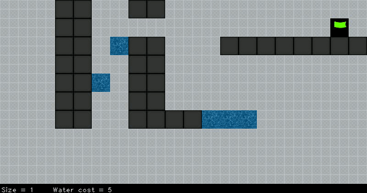

# Multi_Tiles_AStar

This program was originally paired with another map-generating program using a perlin-noise related generator.
The ASTAR is a pathfinding algorithm that seek the shortest path between two points. This implementation supports characters that have a multiple-tiles width.
